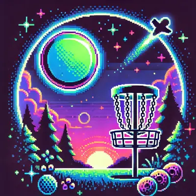
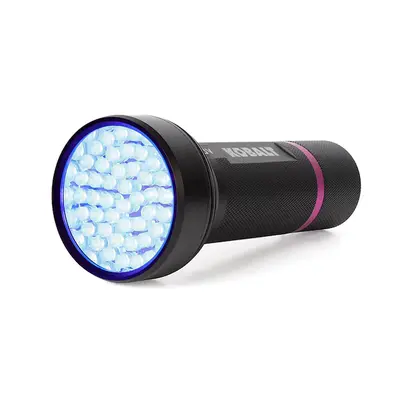
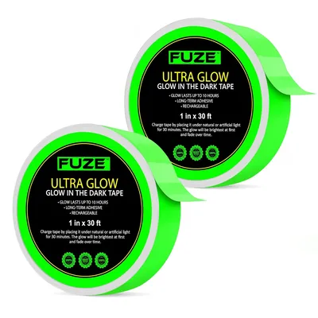

ChatGPT Generated

After playing my first glow round of disc golf I wanted to get some gear to make it nicer.

# Charging

To "charge" the disc my buddy has this [beast of a UV flashlight](https://www.lowes.com/pd/Kobalt-Blacklight-51-Uv-LED-Flashlight-Aa-Battery-Included/5013922183?store=616&cm_mmc=shp-_-c-_-prd-_-hdw-_-ggl-_-CRP_SHP_LIA_HDW_Online_E-F-_-5013922183-_-local-_-0-_-0&gad_source=1&gclid=CjwKCAjw1NK4BhAwEiwAVUHPUAp4S-MOIJdKpkUCd1isOwMm6lyB9rv5O_XpFt9HTR9-e5174jcdUhoCiioQAvD_BwE&gclsrc=aw.ds) so I bought one:

This image from Lowe's

# Other Lighting

A few things that I realized were:
- It is useful to have some kind of light on your cart so you can find it
- You don't have to buy glow discs, use tape for your tried and true discs you use

Glow tape is the answer; I was given some glow tape, but found some [thicker tape online](https://www.amazon.com/dp/B07V5SNVK9):

This image from Amazon