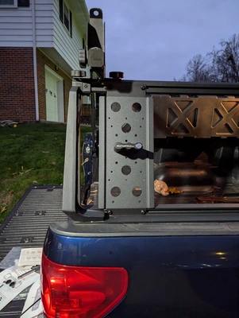
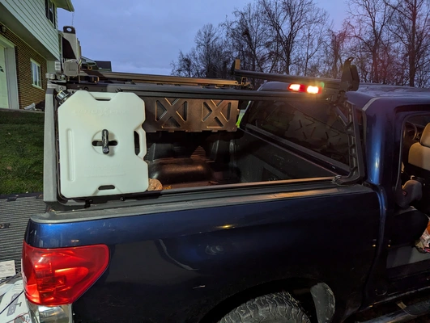

When car camping I found bringing water was annoying.

I thought a dedicated Rotopax mounted to my [truck rack](https://www.leitnerdesigns.com/products/classic-active-cargo-system-ldasm) would bring it front and center and be really durable. I didn't have anything mounted on the passenger side of my truck anyway.

I decided to mount it in the back because it can be difficult to access things in the front of the bed (by the glass). A Rotopax in the way would make it even harder. So I put it towards the tailgate because it's easy to get to gear back there and get around where it's mounted.

It'll be a little awkward to fill as we use filtered water from our fridge, but worth it by not throwing away plastic.

Also, probably should wash this before using it...

**What I bought:**
1. [UNIVERSAL MOUNTING PLATE](https://www.leitnerdesigns.com/collections/accessories/products/universal-mounting-plate)
2. [ROTOPAX 2 GALLON WATER CAN - GEN 2](https://www.leitnerdesigns.com/collections/accessories/products/rotopax-2-gallon-water-can)
3. [ROTOPAX LOX PACK MOUNT](https://www.leitnerdesigns.com/collections/accessories/products/rotopax-lox-pack-mount)

Added up to about: **$265**