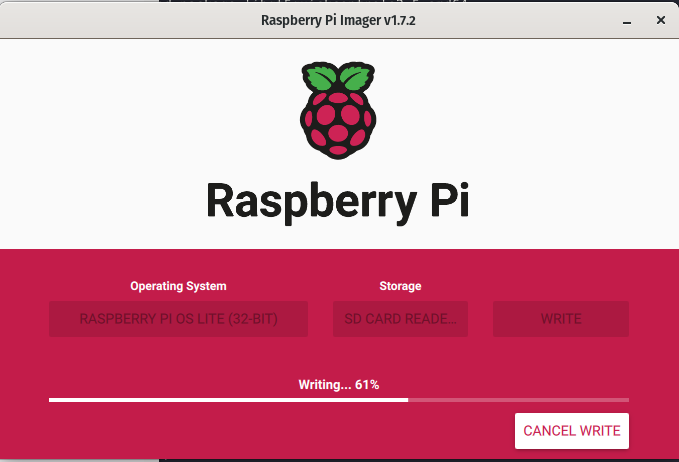

The [Raspberry Pi Imager](https://www.raspberrypi.com/software/) is a pleasure to work with, especially around setting up a headless pi.

I used: `sudo apt install rpi-manager`

It is weird though, when searching for the GUI app in Pop OS, be sure to search for "Imager"

