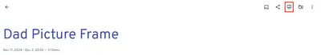

# Idea

My wife got her parents a [Skylight Frame](https://www.skylightframe.com/products/the-skylight-frame/?srsltid=AfmBOorpbYMES_rLjptr8JEHq2IyhVGfDGJFCF6x4pVChcLKroZoVWJB). It is pretty cool and I thought my father would like it (74 yrs old).

Being cheap, I thought > $100 was a bit steep.

A few months ago he got internet access for the first time so that would allow this type of product.

Since I had a spare laptop there not doing anything I thought I could DIY this; ideally, with minimal custom code. I started down the custom code path, thinking this would be fun, but I then thought... I bet someone has already created this solution...

# Solution: ImmichFrame

I thought, I'm using [Immich](https://immich.app/), I wonder if there are any live picture frames that integrate with it? I then saw Immich had a beautiful slideshow feature built-in for albums:

[](/images/immich-album-slideshow.png)

I needed to be careful, I didn't want him to have to log into anything. So, I found [ImmichFrame](https://github.com/immichFrame/ImmichFrame). The docker compose:

```yaml
services:
  immichframe:
    container_name: immichframe
    image: ghcr.io/immichframe/immichframe:latest
    restart: on-failure
    ports:
      - "2383:8080"
    environment:
      TZ: "America/New_York"
      ImmichServerUrl: http://192.168.86.100:2283
      ApiKey: ${FRAME_API_KEY}
      Albums: "13fabba8-aa2a-4d6e-937f-cf17fb52aace"
      Interval: 15
      RefreshAlbumPeopleInterval: 1
```

It was a pretty big pain to get this up and running. But some takeaways:
- I added this to the same docker compose as my Immich docker compose
- I use the IP of my server and the Immich exposed port: `2283`
- The `.env` file has the api key
- I had to find the album id by navigating to the album in the Immich UI and copied it from the URL
- I preferred an interval of `15` seconds and I want it to re-pull images from the album every `1` hour

So now I have the laptop at his house set up as:
- Power settings are never dim or turn off
- I opened chrome, navigated to my server and the port: `2383`
- Hit `F11` for full screen and called it a day 🎉