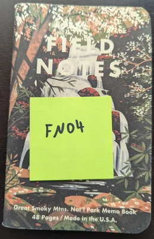
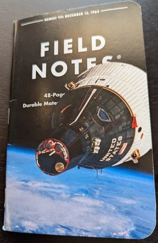

import BestImage from '../../components/BestImage.astro'
import front from '../../assets/notebooks/FN06.jpg'
import sixpageone from '../../assets/notebooks/FN06-page01.jpg'
import sixpagetwo from '../../assets/notebooks/FN06-page02.jpg'

import seven from '../../assets/notebooks/FN07.jpg'
import sevenpage26 from '../../assets/notebooks/FN07-page26-27.jpg'
import sevenpage40 from '../../assets/notebooks/FN07-page40.jpg'
import sevenpage42 from '../../assets/notebooks/FN07-page42.jpg'
import sevenpage48 from '../../assets/notebooks/FN07-page48.jpg'

import eight from '../../assets/notebooks/FN08.jpg'

export const notebook7Progress = Math.round(2 / 48 * 100)

# Overview

I go back and forth on carrying a notebook. It is a part of my [edc](/edc) currently.

# Notebook 08 (Current)

<BestImage image={eight} alt="Notebok 08" height={400} />

When I was in the multi-notebook phase for a brief amount of time this one was on my desk. It has a few projects but mainly work related things within it.

What makes it stand out is no stamps on the last page! I'm not used to that. Will need to visit some new places.

I'm curious how this cover holds up as it has a plastic rigidity to it vs pure paper covers like the previous.

# Notebook 07
<BestImage image={seven} alt="Notebook 07" height={400} />

<BestImage isFigure={false} image={sevenpage26} alt="Notebook 07, Pages 26, 27" height={200} />
[Great Wolfe Lodge Adventure](/blog/2025-01-14-great-wolfe-lodge/)
<BestImage isFigure={false} image={sevenpage40} alt="2025 Florida Vacation" height={200} />
<BestImage isFigure={false} image={sevenpage42} alt="2025 Florida Vacation" height={200} />
<BestImage isFigure={false} image={sevenpage48} alt="Stamps" height={200} />
[2025 Florida Vacation](/blog/testies) | Random Stamps

This notebook I had back in 2020 when I was keeping track of my climb gym sessions on paper.

There were
a few pages without much content, things like goals, injuries, etc. I decided to keep those and not monopolize as I have plenty of other
notebooks. It felt good to append to it but not overwrite.

# Notebook 06
<BestImage image={front} alt="Notebook 06" height={400} />

**Consolidate**

I had a bunch of notebooks distributed and wanted to consolidate as I wasn't using any of them separately.

This one in particular I started back in 2021 when I was writing down my climbs. I didn't pick it back up until 2024. This was hanging out in my climbing bag, but I never used it.

Why consolidate? I wanted to keep track, and why not just use one for everything with all kinds of various content. I'd already proven that multiple notebooks don't really work for me personally.

(Although, I do have one in the shower, and it will stay there, it gets used once in a while.)

**Feel Good**

I wanted the feeling of completing a notebook and starting to document it to set the stage for the future to iterate; so this notebook is where that started for 2024.

**Pages**

<BestImage isFigure={false} image={sixpageone} alt="Notebook 06, Page 01" height={200} />
<BestImage isFigure={false} image={sixpagetwo} alt="Notebook 06, Page 02" height={200} />

# My Notebooks

I like Field Notes (FN). Here are notebooks 1 - 6:

<BestImage isFigure={false} image={seven} alt="Notebok 07" height={400} />

