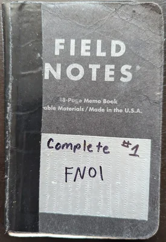

import front from '../../assets/notebooks/FN06.jpg'
import sixpageone from '../../assets/notebooks/FN06-page01.jpg'
import sixpagetwo from '../../assets/notebooks/FN06-page02.jpg'
import seven from '../../assets/notebooks/FN07.jpg'
import sevenpage26 from '../../assets/notebooks/FN07-page26-27.jpg'
import BestImage from '../../components/BestImage.astro'

export const notebook7Progress = Math.round(2 / 48 * 100)

# Overview

I go back and forth on carrying a notebook. It is a part of my [edc](/edc) currently.

# Notebook 07 (Current)
<BestImage image={seven} alt="Notebook 07" height={400} />

	

 

<BestImage isFigure={false} image={sevenpage26} alt="Notebook 07, Pages 26, 27" height={200} />
[Great Wolfe Lodge Adventure](/blog/2025-01-14-great-wolfe-lodge/)

# Notebook 06
<BestImage image={front} alt="Notebook 06" height={400} />

**Consolidate**

I had a bunch of notebooks distributed and wanted to consolidate as I wasn't using any of them separately.

This one in particular I started back in 2021 when I was writing down my climbs. I didn't pick it back up until 2024. This was hanging out in my climbing bag, but I never used it.

Why consolidate? I wanted to keep track, and why not just use one for everything with all kinds of various content. I'd already proven that multiple notebooks don't really work for me personally.

(Although, I do have one in the shower, and it will stay there, it gets used once in a while.)

**Feel Good**

I wanted the feeling of completing a notebook and starting to document it to set the stage for the future to iterate; so this notebook is where that started for 2024.

**Pages**

<BestImage isFigure={false} image={sixpageone} alt="Notebook 06, Page 01" height={200} />
<BestImage isFigure={false} image={sixpagetwo} alt="Notebook 06, Page 02" height={200} />

# My Notebooks

I like Field Notes (FN). Here are notebooks 1 - 6:

