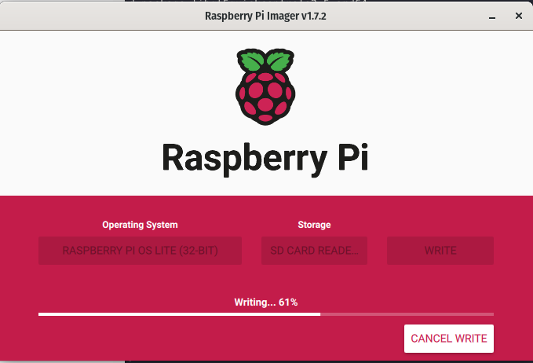

### Update 2025-01-08 Configuration settings don't work

It seems I still have to set up hostname, wireless, enable ssh, etc. with a hardware keyboard connected to the PI.

Not sure what is going on there but will worry about it down the road.

**Links**

- [How to check filesystem for errors - Raspberry Pi Forums](https://forums.raspberrypi.com/viewtopic.php?t=8451)
- [fsck(8): check/repair file system - Linux man page](https://linux.die.net/man/8/fsck)
- [ext4 - fsck won't fsck (unable to set superblock flags) - Unix & Linux Stack Exchange](https://unix.stackexchange.com/questions/327863/fsck-wont-fsck-unable-to-set-superblock-flags)
- [Force a full fsck on reboot, ignoring the dirty flag - Raspberry Pi Forums](https://forums.raspberrypi.com/viewtopic.php?t=15870)
- [command line - Can I run fsck or e2fsck when Linux file system is mounted? - Ask Ubuntu](https://askubuntu.com/questions/47953/can-i-run-fsck-or-e2fsck-when-linux-file-system-is-mounted)

# Overview

The [Raspberry Pi Imager](https://www.raspberrypi.com/software/) is a pleasure to work with, especially around setting
up a headless pi.

I used: `sudo apt install rpi-manager`

It is weird though, when searching for the GUI app in Pop OS, be sure to search for "Imager".

I use Raspberry Pi OS Lite 32bit for Pi Zero's for no proven reason besides trying to be barebones as possible.

The Lite OS is under the menu: "Rasperry PI OS (other)".
