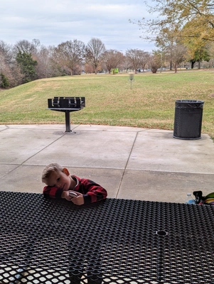

Took a quick trip at the tail end of my PTO chasing some warmish weather.

# Planning

So not too healthy... but trying to make traveling easier. This is a fridge basket for our Dometic CFX3 45 fridge.

# Sunday December 8th 2024

- Carolina's Diner - Greensboro
- Lake Reidsville Park DGC
- Holly Run at Northeast Park
- Courtyard by Marriott Burlington

At Lake Reidsville I threw a forehand zone into the hollowed out tree above. The left image is no zoom and the right is
zoomed in.

The family taking a break.

The playground and campground looked great at Lake Reidsville.

# Monday December 9th 2024

- Carver's Restaurant
- Greensboro Science Center
- Springwood Player's Course
- Ruckus Climbing Gym
- TownePlace Suites Greensboro Coliseum

The "zoo" (Science Center) was a big success for the family. Would recommend. The treehouses with dinosaurs were such a
good idea... and
free.

This hand warmer is great, not sure what brand it is. Also, somebody is getting tired...

The Springwood course was alright for a Blue difficulty. Worth playing once.

While at the Ruckus climbing gym I saw some awesome
chairs: [Melino Wooden Folding Chair](https://www.costco.com/melino-wooden-folding-chair.product.100768979.html).

# Tuesday December 10th 2024

- Quaker Steak & Lube
- Redeemer Yellow