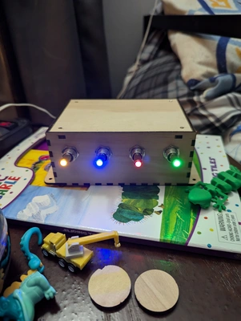
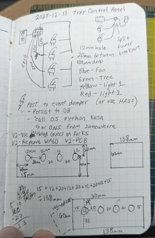
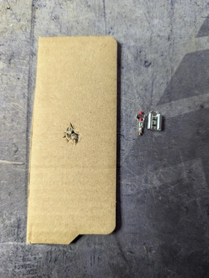
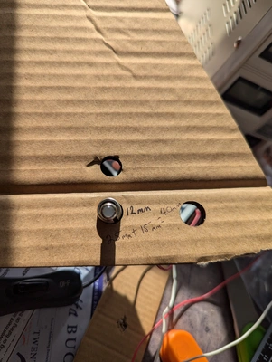
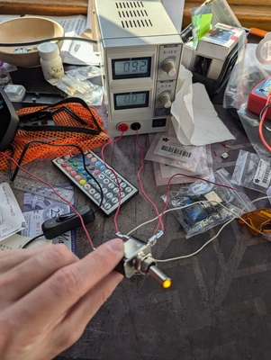
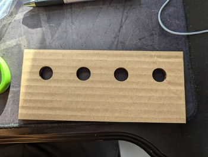
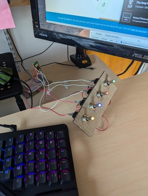
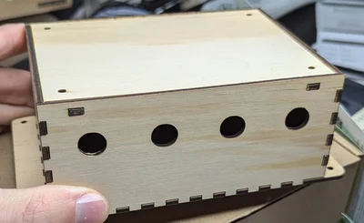

[//]: # (todo: show the link to the box website)

[//]: # (todo: list out colors)

[//]: # (todo: list out parts list)

[//]: # (todo: 2021 she got laser)

[//]: # (todo: fritzing)

[//]: # (code reference)

[//]: # (pic of wires in box)

[//]: # (power)

# Final Product

# Overview

I've had really nice [toggle switches](https://www.adafruit.com/product/3218) from Adafruit that I bought on 2021-09-14
and still haven't used them!

A control panel has always interested me but I never had a project that it made sense for... until now.

> I thought it would be cool to have a control panel my son could use to turn off his lights and turn on his fan

He can reach all but one light, so this wasn't exactly needed... but it is fun to flip toggle switches, especially if
they light up. Anything to make bedtime easier.

# How it works

A Pi Pico W listens for toggle switching and makes a POST request to my server, I fire off a Temporal workflow, that
workflow makes a call to the smart switch's API to turn it on or off.

# My Process

It all started on paper. No comment on content and penmanship ha. I played with crimping the connectors, but I didn't
have the correct crimper or know what I was doing. I also started to cut the hole manually for the switches and that was
annoying. Using the
laser is **so** much faster.

Couldn't find a caliper so took a ruler and did some measuring and made a few holes to find the correct size. I briefly
looked at the toggle switch specs but didn't see a dimension for the threads.

This was a SVG that I created in InkScape and sent to my wife to import into LightBurn to laser cardboard.

I started with a power supply as I suck with electronics and certainly cause shorts... and the power supply lets me know
that without sacrificing any microcontrollers or making my computer's USB port mad.

I also wasn't clear how to wire it up, so this helped.

Had to remove switch covers as my 3-year-old had a hard time flipping them.

Micropython time as it makes dealing with microcontrollers so much more approachable.

[Boxes.py](https://boxes.hackerspace-bamberg.de/) made this super easy. We use it first, then added the circles to the
side we wanted.

