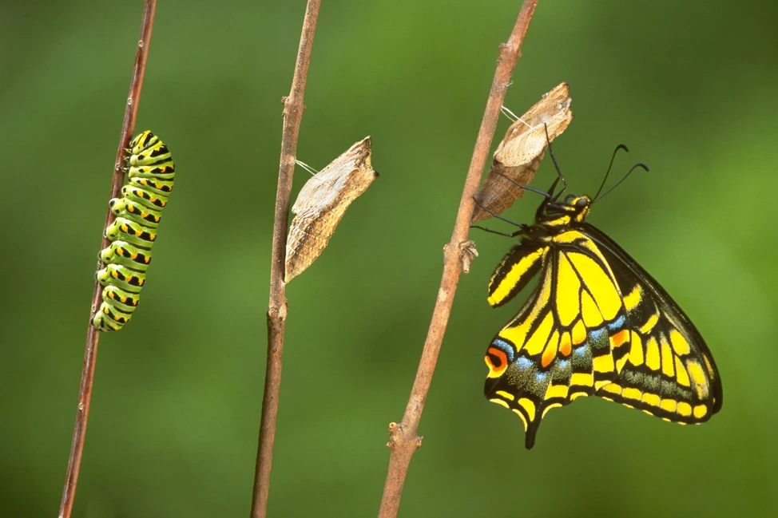

Source [discoverwildlife.com](https://www.discoverwildlife.com/animal-facts/insects-invertebrates/how-does-a-caterpillar-turn-into-a-butterfly)

Once again I'm redoing this website.

I have never gotten traction on blogging; ever.

#### I've tried a few things:

- Next.JS Templates
- Gatsby
- Hugo
- Thought about using Strapi that powered some frontend

#### Some hosted solutions I never stuck with:

- Medium
- Write.as
- Hashnode.com

#### A few things I want to try:

- [DALL-E](https://labs.openai.com/) - Mixing in images that are similar to the mood you are conveying in your article is a pretty neat idea. Plus, 2 days ago DALL-E made itself public 👍

#### Why keep switching so often?

I actually enjoy the WordPress style of CMS driving your blog. I don't want to need my IDE or a text editor to make content. So I've just been going back-and-forth over and over **and over** on deciding.

> Well I've decided on doing markdown or MDX instead of a CMS like Strapi because... it's just easier... right? It's just simple files... right?

#### Why Docusaurus?

> I want something Easy

- Something that I host myself/own
- **Easy**
- Fast
- Can post tech things or gross medical things
- RSS out of the box
- Don't have to worry about styling
- Search is easy to add!
- Just working with files and directories is easier... right? `#dontoverengineer`
- Lets me do raw React and does all the Markdown niceness like [Admonitions](https://docusaurus.io/docs/markdown-features/admonitions), didn't even know this was available
- More reasons to come...

#### Cons
Apparently Babel doesn't like folder names with periods. I'm using nx.dev and docusaurus; so I had to [rename my package](https://github.com/facebook/docusaurus/discussions/7228) 

#### Future plans

This will update over time 🤷

#### Wrap it up

I hope this blog will take traction for 20 yeas and I don't spend any **more** brain cycles on it 😉

<iframe src="https://giphy.com/embed/xiUlJu5XGaixqMsr6d" width="480" height="343" frameBorder="0" class="giphy-embed" allowFullScreen></iframe>
<a href="https://giphy.com/gifs/fallontonight-jimmy-fallon-tonightshow-hoping-for-the-best-xiUlJu5XGaixqMsr6d">via GIPHY</a>

