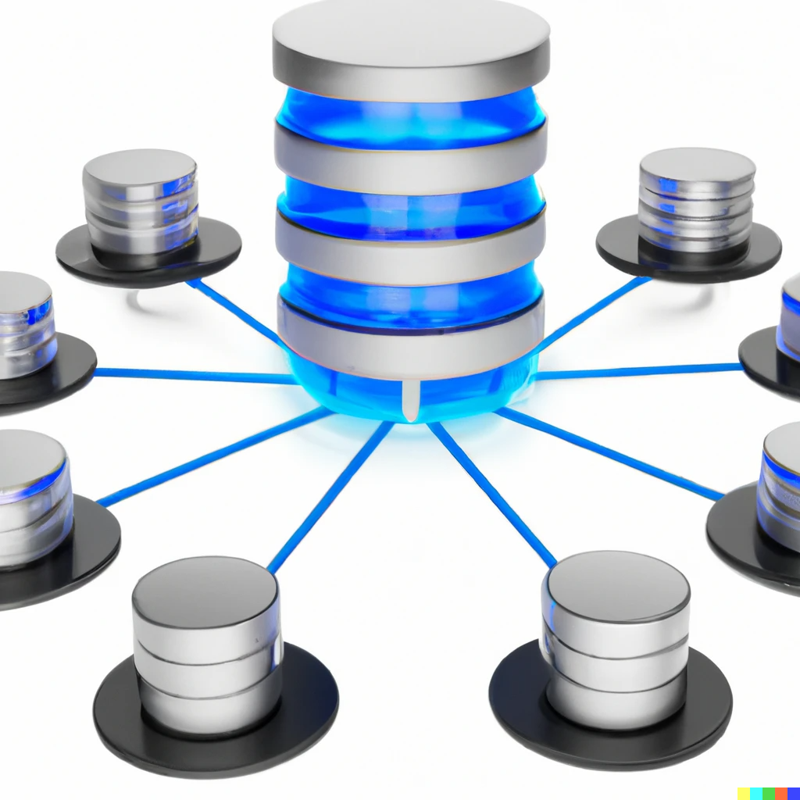

# Eventstore DB vs DynamoDB

## Why am I looking into these databases?

A database that supports event sourcing and has a few features I'm looking for

## What am I looking for?

- Low price - this is for my personal projects, not a multi-tenant production app
- Ease of use
- Easy cloud function connectivity
- Subscribe to data changes (or use traditional pub/sub and be notified that way)

As I began to investigate DynamoDB I thought about similar functionality to Eventstore DB.

I mean you can use a lot of databases for event sourcing
