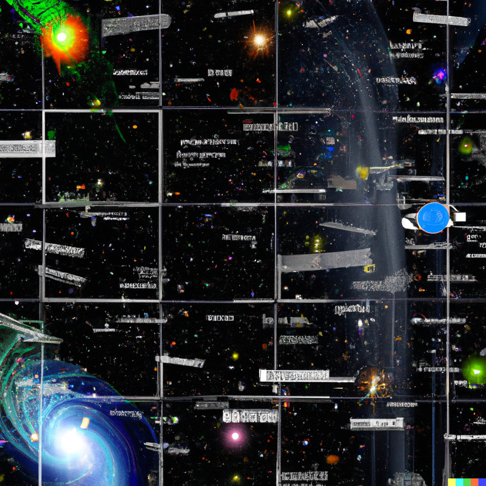

# Current Software North Star

*DALL-E Search: software architecture universe stellar space*

## Background

I want to use Typescript and C# or GoLang to build my projects. Those are my interests right now. 

I also wanted to Halo names as codenames but I literally forget their purpose a day later... so not sure if that is a good idea.

# Goals

**lanekatris.com** - My landing page with Docusaurus to act as a blog

**loonison.com** - Password protected app that has my dynamic admin utilities

**Infrastructure** - (Name is TBD) This is how I want to create cloud resources via IaC

**POC (Proof of Concept)** - This could also be named *random projects*. I need a place for one-off projects and since TS is my easiest language to build things I want to do it here

**C# Solution** - (Name is TBD) This is what will run on my PC or wherever that will do things against my personal machine, like checking driver versions or preventing games from being started up

> This is one of the biggest issues, finding that happy medium between IaC code and actually application code and 

I *think* this is all I need for now. I keep over engineering

> I want to build features quickly... not worry about infrastructure or dealing with stupid dependency management issues

<iframe src="https://giphy.com/embed/RHLcOWQ4xqyOKvqzAc" width="480" height="270" frameBorder="0" class="giphy-embed" allowFullScreen></iframe>
<a href="https://giphy.com/gifs/bestfriends-wow-goat-RHLcOWQ4xqyOKvqzAc">via GIPHY</a>

### Project Structure Scratch Pad

Remember - Pulumi doesn't work well inside nx.dev monrepo

- software
	- infrastructure ❌
	- js
		- packages
			- lanekatriscom ✅
			- loonisoncom ❌
			- poc ✅
	- NvidiaTestDemo ✅ (Needs renamed) .NET

### Javascript Monorepo Woes

I love the idea of a monorepo for TypeScript but you get dependency issues like Docusaurus not supporting React 18 but Next.js does. This breaks `npm install`. So what do you do? Well right now I'm just `--legacy-peer-install`'ing right now

https://github.com/facebook/docusaurus/issues/7264